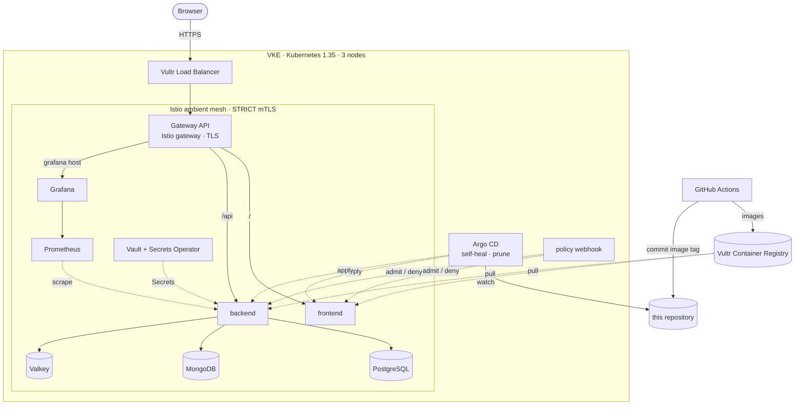

# Vultr DevOps Assignment — Cloud-Native Application Platform

A 2-tier application on Vultr Kubernetes Engine with an Istio ambient mesh,
Gateway API ingress, three databases, Vault-managed secrets, Prometheus and
Grafana, and a GitOps pipeline that builds, scans, deploys and rolls back.

## Live deployment

| | URL |
|---|---|
| Frontend | https://app.139.84.159.60.sslip.io |
| API — status | https://app.139.84.159.60.sslip.io/api/status |
| API — messages (`GET`, `POST`) | https://app.139.84.159.60.sslip.io/api/messages |
| Grafana | https://grafana.139.84.159.60.sslip.io (login supplied with the submission) |

Dashboards: **Application Overview** and **Infrastructure Overview**, under
the `custom` tag. Cluster access is described in
[docs/setup-guide.md](docs/setup-guide.md#23-cluster-access).

```bash
curl https://app.139.84.159.60.sslip.io/api/status
curl -X POST -d '{"text":"hello"}' https://app.139.84.159.60.sslip.io/api/messages
```

## Architecture



Full diagrams (request flow, secrets flow, CI/CD) and the reasoning behind
each decision are in [docs/architecture.md](docs/architecture.md).

## What is here

| Requirement | Implementation | Where |
|---|---|---|
| VKE, registry, remote state | Terraform; state in Vultr Object Storage with locking | [terraform/](terraform/) |
| Three databases with persistent volumes | PostgreSQL, MongoDB, Valkey — local Helm chart | [bootstrap/databases/](bootstrap/databases/) |
| Istio ambient, mTLS | Istio 1.30, mesh-wide `STRICT` | [bootstrap/istio/](bootstrap/istio/) |
| Gateway API | One Gateway, HTTPS via cert-manager, path-based `HTTPRoute` | [bootstrap/gateway/](bootstrap/gateway/), [k8s/overlays/prod/httproute.yaml](k8s/overlays/prod/httproute.yaml) |
| Prometheus, ServiceMonitors, alert rules | kube-prometheus-stack, 7 custom rules | [bootstrap/observability/](bootstrap/observability/) |
| Grafana, 2 custom dashboards | Application + Infrastructure, as JSON in git | [bootstrap/observability/dashboards/](bootstrap/observability/dashboards/) |
| Secrets operator | Vault + Vault Secrets Operator | [bootstrap/secrets/](bootstrap/secrets/) |
| Frontend and backend | Go, multi-stage, multi-arch, `scratch` images | [app/](app/) |
| Kustomize base + overlays | dev, staging, prod | [k8s/](k8s/) |
| HPA, PDB, anti-affinity, limits, security context, three probes | On both Deployments | [k8s/base/](k8s/base/) |
| Build, scan, SBOM | Trivy (CRITICAL fails), SPDX SBOM, on every PR | [.github/workflows/build-scan.yaml](.github/workflows/build-scan.yaml) |
| Deploy, verify, smoke test, rollback | dev → staging → prod promotion | [.github/workflows/deploy.yaml](.github/workflows/deploy.yaml), [.github/scripts/deploy.sh](.github/scripts/deploy.sh) |

Beyond the specification:

- **Argo CD** — GitOps delivery with self-heal and prune ([bootstrap/argocd/](bootstrap/argocd/))
- **Admission webhook** — enforces image, label, limit and privilege policy in the app namespaces ([bootstrap/policy/](bootstrap/policy/))
- **HTTPS** — Let's Encrypt certificates through cert-manager ([bootstrap/cert-manager/](bootstrap/cert-manager/))
- **Least-privilege CI** — the pipeline's cluster account can only watch rollouts ([bootstrap/ci-access/](bootstrap/ci-access/))
- **Protected `main` and a human gate on prod** — merges need a pull request with passing lint, tests, builds and scans; production deploys wait for an approval ([.github/rulesets/](.github/rulesets/))
- **Database access policy and backups** — only the backend's mesh identity may reach the databases; nightly dumps to object storage ([bootstrap/databases/](bootstrap/databases/))

## Documentation

- [docs/architecture.md](docs/architecture.md) — diagrams, data flow, CI/CD, assumptions, limitations, suggested advancements
- [docs/setup-guide.md](docs/setup-guide.md) — prerequisites, provisioning, bootstrap, deployment, rollback
