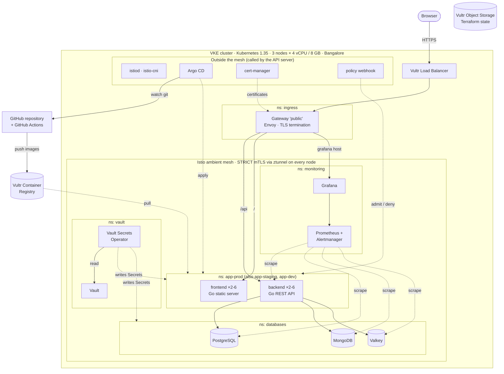
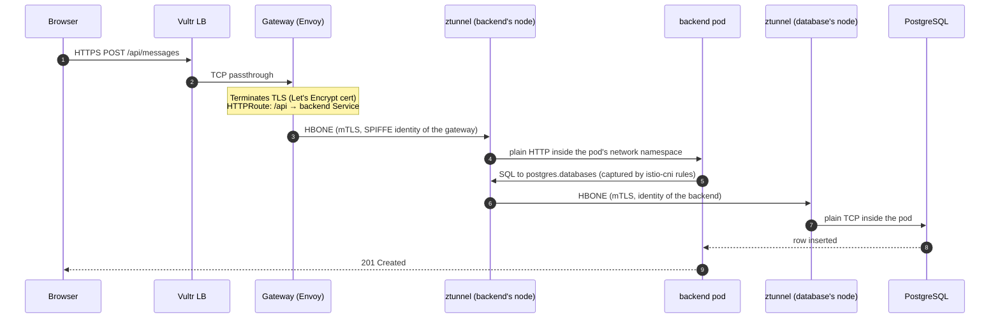
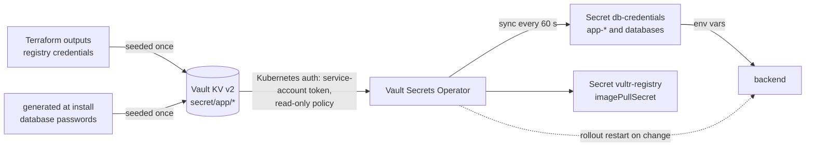
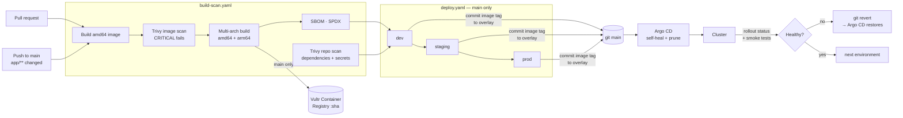

# Architecture

A 2-tier web application on Vultr Kubernetes Engine (VKE), with an Istio
ambient service mesh, Gateway API ingress, three databases, Vault-managed
secrets, Prometheus/Grafana observability and a GitOps delivery pipeline.

| | |
|---|---|
| Frontend | https://app.139.84.159.60.sslip.io |
| API | https://app.139.84.159.60.sslip.io/api/status · `/api/messages` |
| Grafana | https://grafana.139.84.159.60.sslip.io |

## 1. System architecture

### Components

| Layer | Component | Role |
|---|---|---|
| Infrastructure | Terraform | VKE cluster, container registry; state in Vultr Object Storage with lockfile locking |
| Mesh | Istio 1.30 ambient | `ztunnel` (one per node) gives every enrolled pod mTLS at L4, with no sidecars. Mesh-wide `PeerAuthentication` is `STRICT` |
| Ingress | Gateway API + Istio gateway controller | One `Gateway`, one load balancer. `HTTPRoute`s do path- and host-based routing |
| TLS | cert-manager + Let's Encrypt | Certificates for both hostnames via HTTP-01 through the Gateway |
| Application | frontend, backend | Two Go services in `scratch` images |
| Data | PostgreSQL, MongoDB, Valkey | One StatefulSet each, 10 GiB Vultr block volume, exporter sidecar |
| Backup | CronJob → Vultr Object Storage | Nightly logical dump of all three databases, kept 14 days |
| Secrets | Vault + Vault Secrets Operator | Passwords and registry credentials live in Vault and are synced into Kubernetes Secrets |
| Observability | kube-prometheus-stack | Prometheus, Alertmanager, Grafana, node-exporter, kube-state-metrics |
| Delivery | GitHub Actions + Argo CD | Build, scan, SBOM; Argo CD applies Kustomize overlays with self-heal and prune |
| Policy | k8s-policy-webhook | Validating admission webhook enforcing image, label, limit and privilege rules in app namespaces |

## 2. Component interactions and data flow

### A request, end to end

Points worth knowing:

- **The application and databases speak plain text; ztunnel encrypts.** Neither
  the Go code nor PostgreSQL is configured for TLS. `istio-cni` redirects each
  enrolled pod's traffic to the ztunnel on its node, which wraps it in mTLS
  (HBONE, port 15008) using a per-service-account SPIFFE certificate issued by
  istiod.
- **STRICT means plain text from outside the mesh is refused.** Verified: a
  pod in the un-enrolled `default` namespace cannot open a connection to the
  backend.
- **What mTLS does not do.** It authenticates and encrypts pod-to-pod traffic.
  On its own it does not authorise: that is what the `AuthorizationPolicy`
  on the databases namespace adds, admitting only the backend's identity on
  the database ports, Prometheus on the exporter ports and the backup job.
  Each Deployment has its own service account so those identities differ.
  mTLS also does not encrypt data at rest, and does not protect against a
  compromised pod using its own valid identity.
- **Why ambient rather than sidecars.** No proxy container per pod: lower
  memory use, no pod restart to join the mesh, and application pods keep a
  minimal security context. The cost is that L7 features (per-route retries,
  HTTP authorisation) need an extra waypoint proxy; this project only needs L7
  at the edge, where the Gateway provides it.
- **Things the Kubernetes API server calls stay outside the mesh.** The API
  server is not a mesh workload, so under STRICT it cannot reach admission
  webhooks in enrolled namespaces. cert-manager, the policy webhook and Argo CD
  therefore run in un-enrolled namespaces, and the Prometheus operator's
  webhook is disabled.

### What each database is for

| Store | Used for | Why this store |
|---|---|---|
| PostgreSQL | `messages` table — the system of record | Relational, transactional |
| MongoDB | `audit_events` — one document per created message | Append-only, schemaless; best-effort so an audit failure never fails a user request |
| Valkey | `visits` counter | Atomic in-memory `INCR`; correct across replicas |

### Health and availability

| Mechanism | Setting | Effect |
|---|---|---|
| Startup probe | `/healthz`, up to 60 s | Holds off liveness/readiness while the process boots |
| Liveness probe | `/healthz`, checks nothing external | Restarts a hung process. Deliberately ignores databases, so a database outage cannot cause a restart storm |
| Readiness probe | backend `/readyz` pings all three databases | Removes a pod from the Service while it cannot serve, without restarting it |
| HPA | CPU 70 % of request, 2–6 replicas (prod) | Scales out under load; 5-minute scale-down window prevents flapping |
| PDB | `maxUnavailable: 1` | A node drain evicts at most one replica at a time |
| Anti-affinity | preferred, by hostname | Replicas spread across nodes; "preferred" so scaling beyond 3 replicas is still schedulable |
| Rolling update | `maxUnavailable: 0`, `maxSurge: 1` | Capacity never drops during a deploy; a broken image never replaces a working pod |
| Security context | non-root UID 65532, read-only root filesystem, no privilege escalation, all capabilities dropped, seccomp RuntimeDefault | Applied to the app, the databases and their exporters |

### Secrets flow

No secret is stored in git. The operator authenticates with a short-lived
service-account token that Vault validates against the Kubernetes API, so
there is no long-lived Vault credential in the cluster.

### Observability

- **ServiceMonitors** for the backend and each database exporter; a
  **PodMonitor** for ztunnel.
- **Alert rules** (`bootstrap/observability/alerts.yaml`):
  `BackendHighErrorRate`, `BackendHighLatency`, `BackendDependencyDown`,
  `PodCrashLooping`, `DatabaseDown`, `PersistentVolumeFillingUp`,
  `NodeMemoryHigh` — in addition to the chart's defaults.
- **Dashboards** (JSON in git, loaded by Grafana's sidecar):
  *Application Overview* (rate, errors, latency percentiles, dependencies,
  replicas vs HPA) and *Infrastructure Overview* (nodes, volumes, databases,
  mesh connections).

## 3. CI/CD pipeline

**Build and scan** (every pull request, and every push to `main` that touches
`app/`):

0. Lint and test: `gofmt`, `go vet`, `go test -race`, render every Kustomize
   overlay, `helm lint`, `terraform validate`, `shellcheck`.
1. Build the amd64 image and load it locally.
2. Trivy scans it. HIGH and CRITICAL are reported; a fixable CRITICAL fails
   the build.
3. Build amd64 + arm64. Go cross-compiles on the runner's native CPU, so no
   QEMU emulation is involved. Pushed only from `main`, tagged with the short
   commit SHA.
4. An SPDX SBOM is attached to the run as an artifact.
5. In parallel, Trivy scans the repository for vulnerable dependencies and
   committed secrets (blocking) and for misconfigurations (report only).
6. Outside the pipeline, GitHub Dependabot alerts watch `go.mod` continuously,
   so a CVE published after a build is still flagged (repository → Security).

**Deploy** (after a successful build on `main`, or manually with any tag):
for dev, then staging, then — after a person approves the run in GitHub —
prod. Each stage:

1. Commit the new image tag to `k8s/overlays/<env>/kustomization.yaml`.
2. Argo CD renders the Kustomize overlay and applies it.
3. `kubectl rollout status` waits for every new pod to be Ready.
4. Smoke tests through a port-forward: readiness (all databases reachable),
   the reported version equals the deployed tag, a database read, the UI.
   Prod is also tested through its public HTTPS URL.
5. On any failure the commit is reverted, Argo CD restores the previous
   version, that version is re-verified, and the promotion stops.

**Why rollback is a `git revert`.** With self-heal on, Argo CD reverts any
change not in git — including `kubectl rollout undo` — within seconds.

**Gates.** `main` cannot be pushed to directly: a pull request with passing
lint, tests, builds and scans is required. Production cannot be deployed
without a person approving the run. Pull requests from forks need approval
before any workflow runs, and never receive secrets. Findings are also sent
to GitHub code scanning; secret scanning with push protection and Dependabot
alerts are enabled.

**Pipeline security.** Registry credentials and the kubeconfig are GitHub
Actions secrets. The kubeconfig belongs to a service account that can only
watch rollouts, port-forward and request an Argo CD refresh; it cannot read
Secrets or modify workloads. Third-party actions are pinned to commit SHAs.

## 4. Interpretations and assumptions

| Requirement | Interpretation |
|---|---|
| "Proper resource tagging" | Vultr's API has no tag field on VKE clusters or registries, and the Terraform provider cannot set one on a cluster's built-in node pool. Resources share a name prefix and nodes carry `project` / `environment` / `managed-by` Kubernetes labels |
| "Remote state backend (Vultr S3 bucket)" | The bucket is created once outside Terraform (it cannot store state in a bucket it has not created yet). The commands are in the setup guide |
| "At least 3 databases" | PostgreSQL, MongoDB, Valkey. Qdrant omitted: a vector store has no role in this application |
| "Deploy using Helm" for databases | A small local chart (`bootstrap/databases/chart`), one release per database. Community charts depend on images that are no longer freely maintained, and operators add admission webhooks that conflict with STRICT mTLS |
| "Every deployment must include HPA, PDB…" | Applied to the application Deployments. Databases are single-instance StatefulSets with the same security context |
| dev / staging / prod | Three namespaces in one cluster, sharing the database instances. Only prod is public. This demonstrates configuration layering, not environment isolation |
| Repository visibility | Public, so that GitHub's free branch rules, environment approvals and code scanning apply. The full history and all pipeline logs were scanned for secrets before the switch |
| "Kustomize-based deployment" + "automated rollback" | Argo CD renders and applies the Kustomize overlays; the workflow verifies and rolls back by reverting the commit |
| Domain | `sslip.io` wildcard DNS (`<name>.<ip>.sslip.io`), so no domain purchase is needed. The hostnames embed the load balancer IP |
| Helm 4.x | Helm 4.3.0 |

## 5. Known limitations

- **Single-instance databases and Vault.** No replication; a node failure
  means downtime for that store until its pod is rescheduled and its volume
  re-attached.
- **Backups are nightly and in the same region.** Up to 24 hours of writes
  can be lost, and the backup bucket is in Bangalore like the cluster, so it
  protects against deleted volumes or a lost cluster but not a regional
  outage. Vault's own data is not backed up.
- **One object storage key pair.** Vultr issues one key per storage
  subscription, so the backup job's key can also read the Terraform state
  bucket.
- **Vault unseals manually.** After a `vault-0` restart, run
  `bootstrap/secrets/unseal.sh`. Already-synced Secrets keep working meanwhile.
- **One Vault key share**, held in a git-ignored local file.
- **Single control plane** (VKE HA control plane not enabled).
- **Worker nodes are directly reachable.** Each node has a public IP with SSH
  and NodePorts open, so the Gateway can be reached without going through the
  load balancer. VKE's node firewall fixes this but can only be enabled when
  the cluster is created; enabling it now would replace the cluster. SSH
  still requires a key, and nothing but the Gateway is exposed on a NodePort.
- **Authorisation covers the databases only.** An `AuthorizationPolicy`
  restricts the databases namespace to the backend, Prometheus and the backup
  job; other namespaces have no such policy, and there are no
  `NetworkPolicy` objects.
- **Pull requests need passing checks but no second approver.** `main` is
  protected by a ruleset (`.github/rulesets/`): a pull request and four
  passing checks are required, and only the deploy workflow's key may bypass
  it. Required approvals is 0 because a sole maintainer cannot approve their
  own pull request; the human approval sits on the prod deployment instead.
- **CI uses a long-lived service-account token** (narrowly scoped).
- **Alertmanager has no receiver configured**; alerts are visible in
  Prometheus, Alertmanager and Grafana but are not sent anywhere.

## 6. Suggested advancements

- **Progressive delivery** — Argo Rollouts or Flagger for canary releases
  gated on the error-rate and latency metrics that already exist.
- **Database operators** — CloudNativePG and Percona for replication,
  failover and backups to object storage, with port-level mTLS exceptions for
  their webhooks.
- **Vault HA** — three replicas on Raft with transit auto-unseal, and dynamic
  database credentials (short-lived, per-pod) instead of static passwords.
- **Authorisation everywhere** — extend `AuthorizationPolicy` to the app,
  monitoring and Vault namespaces, plus default-deny `NetworkPolicy`.
- **Second reviewer** — raise required pull-request approvals to 1 once
  there is more than one maintainer; keep image tags on a separate branch so
  no identity needs to bypass the ruleset at all.
- **Policy at scale** — Kyverno or `ValidatingAdmissionPolicy` once rules
  outgrow a purpose-built webhook; image signature verification with cosign.
- **DNS and identity** — a real domain with `external-dns`, so hostnames
  survive a load balancer change; OIDC federation for CI instead of a token.
- **Cost** — cluster autoscaler with a smaller baseline node pool.
- **Bootstrap as GitOps** — manage the `bootstrap/` components as Argo CD
  Applications too, so the whole cluster is reconciled from git.
